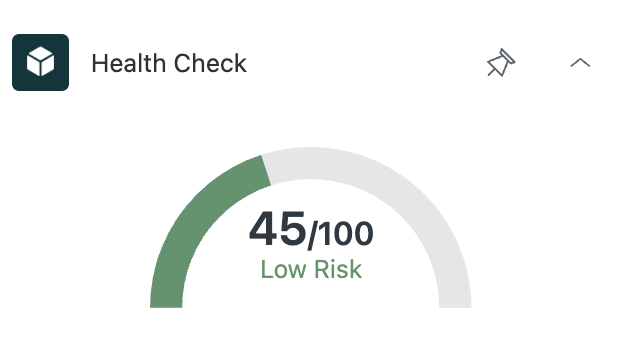

# Risk Predictor

Created by **Team Four Sight**

A Zendesk sidebar application that displays a customer's risk score, allowing support agents to understand at-a-glance the health of a customer relationship.

## Features

  * **At-a-Glance Risk Score:** Displays a clear, numerical score representing the potential risk associated with a customer ticket or profile.
  * **Visual Gauge:** A graphical pressure gauge provides a quick and intuitive understanding of the customer's current health.
  * **Dynamic Color-Coding:** The gauge automatically changes color (green, yellow, red) based on the risk level, providing immediate visual cues.
  * **Seamless Zendesk Integration:** Lives directly in the Zendesk ticket sidebar for easy access without leaving the agent workspace.

### Screenshot

## How It Works

When an agent views a ticket, the Risk Predictor app fetches the associated customer's health score from a backend data source. It then displays this score on the graphical gauge, giving the agent immediate context about the customer's history and potential for churn.

## Development

1.  Make sure you have the Zendesk Command Line Interface (ZCLI) installed.
2.  Run the app locally in your Zendesk instance using `zcli apps:server`.
3.  The app's frontend is located in `assets/iframe.html`. All logic is contained within this file for simplicity.
